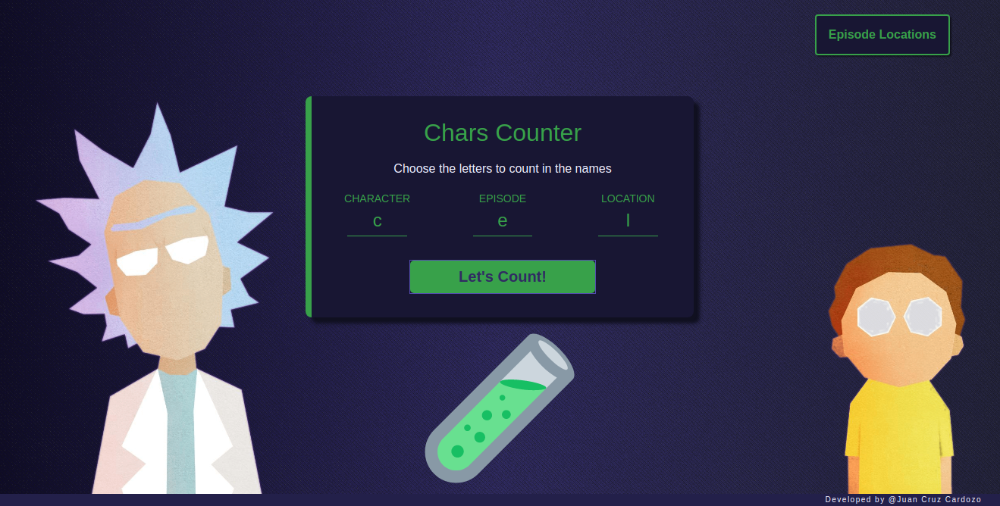

<h1 align="center">
  
   
  ⭐Chipax's Rick and Morty Challenge⭐
</h1>

Frontend client of the challenge, built with React and CSS modules. It shows the results of the challenge's algorythms executed at the backend. The visual design was inspired by images that I found on Google.

 

Click on the image to visit the live version!

 

## Built with
* [React](https://es.reactjs.org/)
* [Webpack](https://webpack.js.org/)
* [Babel](https://babeljs.io/)
* [Axios](https://github.com/axios/axios)

## Other links

* Backend: [https://github.com/SylphidZoul/Chipax-challenge-backend](https://github.com/SylphidZoul/Chipax-challenge-backend)